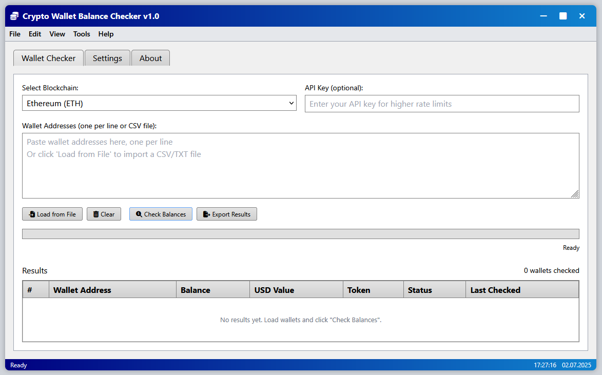

# CRYCKER PRICE TICKER TRC20, ERC20
🇺🇸 Nothing to install, no dependancies. Just a single file you put in your tools folder and run when needed. Configure to automatically start with Windows. Right click to select source, currency and coin.  
🇷🇺 Ничего устанавливать, никаких зависимостей. Просто один файл, который вы помещаете в папку инструментов и запускаете при необходимости. Настроить автоматический запуск
с Windows. Щелкните правой кнопкой мыши, чтобы выбрать источник, валюту и монету.

<!--  -->

🇺🇸 Currently shows data from Bitstamp, Coinbase or Blockchain. Supports Bitcoin, Ethereum, Ripple, Lite Coin, with EUR and USD as currencies.  
🇷🇺 В настоящее время показывает данные из Bitstamp, Coinbase или Blockchain. Поддерживает биткойны, Ethereum, Ripple, Lite Coin, валюты которых — евро и доллары США. 

---

## Change log: ##

**v1.1.1** - 5th March 2024 
* get notifications for x% change
* fixes and optimisations

**v1.0.1** - 7th Oct 2017 
* check for updates automatically, can be turned off in config file
* support for generic currencies, that can be set in config file
* read config file from directory where executable is, not from current working directory
* Bitstamp sometimes returns bogus answer, ignore it
* more robust logging, that could crash the app under certain conditions

---

If you like Crycker, please donate! 

**ETH** to "0x3db88f49a82c8c34f026a32217939c50bda2b881"
**BTC** to "3LxGfSx1Gb24niKUcWz3zmYVuV45NstLZv" 
